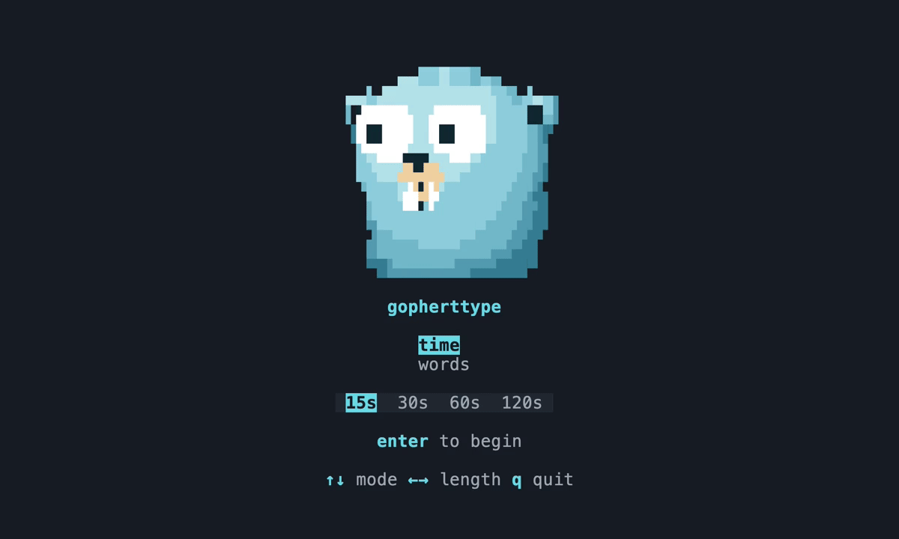

# gopherttype

A simple terminal typing game with word-count and timed rounds, watched by
a gopher that follows your input and reacts to how you type.



## Run the game

Requires Go 1.26.2

```sh
go run ./cmd/gopherttype
```

or build

```sh
go build ./cmd/gopherttype
./gopherttype
```

## Scoring

Scoring follows Monkeytype's mechanics.
WPM counts characters in correctly completed words (including spaces), divided
by five and elapsed minutes. Timed rounds also credit a correct unfinished word.
Accuracy measures correct keystrokes; mistakes still count even after correction.

## Words

Each word is picked independently at random from the bundled
[English word list](internal/words/english.txt), so repeats are possible.
The list is embedded at build time.

## Native mascot preview (developer tool)

Interactive (needs a terminal at least 32×14), held pose or animated demo:

```sh
go run ./cmd/mascot-preview
go run ./cmd/mascot-preview --animate
```

## Runtime

The gopher is a tiny 3D model built from 18 shapes: ellipsoids for its body and
face, rounded plates for its teeth. A CPU ray caster shades a 128×96 sample grid
and packs it into 32×12 terminal cells using Unicode blocks and ANSI colors.
Rotation, blinking, and expressions animate the model - not prerecorded frames.
The same renderer drives every screen on a 120 Hz target clock.

## Built with

[Bubble Tea](https://github.com/charmbracelet/bubbletea),
and [Lip Gloss](https://github.com/charmbracelet/lipgloss).

## Attribution

All typing mechanics are based on [Monkeytype](https://monkeytype.com/).

Go gopher original design by Renee French; adapted here into a shaded terminal
mascot. [Original](https://go.dev/blog/gopher) · [CC BY 4.0](https://creativecommons.org/licenses/by/4.0/).
